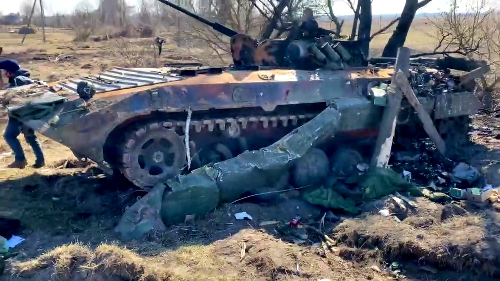
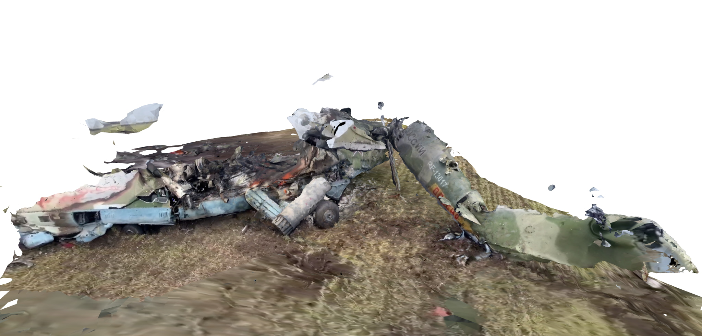
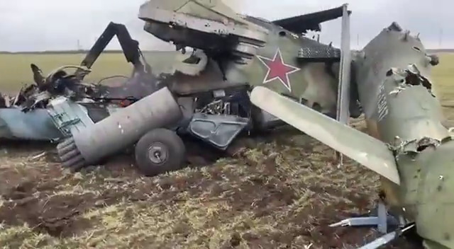
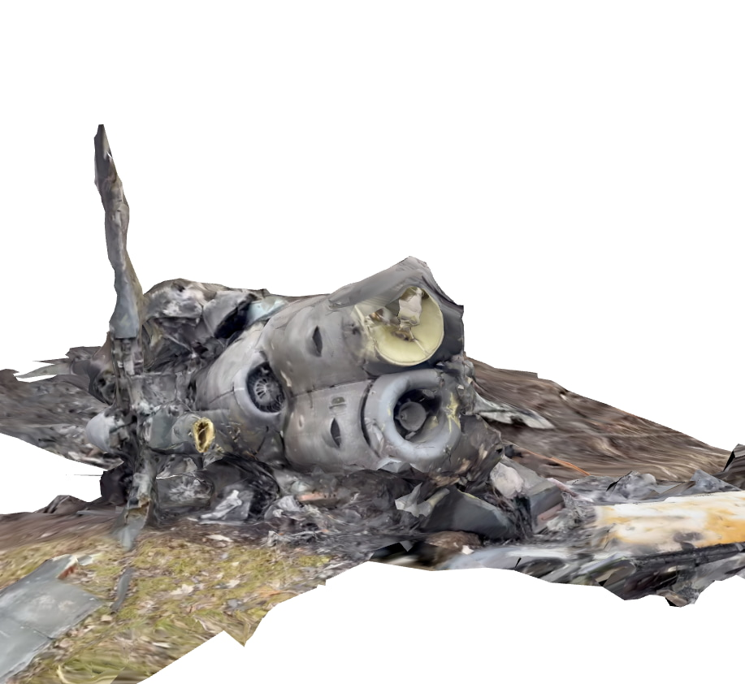

# Ukraine Photogrammetry

Fuck Putin, Слава Україні! 🇺🇦 ✊ 🌻

Those who don't study history are doomed to repeat it, and we can only study what we record. I've been experimenting with creating 3D reconstructions of scenes from Russia's unprovoked invasion of Ukraine using videos from twitter/telegram/tiktok and youtube. I'm making these available here as [CC BY-SA](https://creativecommons.org/licenses/by-sa/4.0/), please DM me on [twitter](https://twitter.com/thot_exper1ment) or email me thot@thiic.cc if you have any questions or have footage to use for more reconstructions. Source code is available on [github](https://github.com/thot-experiment/ukraine-photogrammetry)

## Reconstructed Scenes
These may take a moment to load up, they are 10-20MB each. VR viewing should be available as well with everything scaled true to life. If anyone has information about the original sources of these videos or higher quality versions please contact me.
#### BMP-2 Wreckage
[3D viewer](https://thot-experiment.github.io/ukraine-photogrammetry/bmp2.html)<br>
[](https://thot-experiment.github.io/ukraine-photogrammetry/bmp2.html)
Recreated from [this video](https://twitter.com/IAPonomarenko/status/1504881235675463680)
[](https://twitter.com/IAPonomarenko/status/1504881235675463680)
#### Hind crashed in a field
[3D viewer](https://thot-experiment.github.io/ukraine-photogrammetry/hind.html)<br>
[](https://thot-experiment.github.io/ukraine-photogrammetry/hind.html)
Recreated from [this video](https://twitter.com/girkingirkin/status/1501237568477741058)
[](https://twitter.com/girkingirkin/status/1501237568477741058)
#### Hind crashed on a hillside
[3D viewer](https://thot-experiment.github.io/ukraine-photogrammetry/hind_hill.html)<br>
[](https://thot-experiment.github.io/ukraine-photogrammetry/hind_hill.html)
Recreated from [this video](https://www.youtube.com/watch?v=LRX44ZK4C-Y)
[](https://www.youtube.com/watch?v=LRX44ZK4C-Y)
#### KA-52 crashed in a field
[3D viewer](https://thot-experiment.github.io/ukraine-photogrammetry/ka52.html)<br>
[](https://thot-experiment.github.io/ukraine-photogrammetry/ka52.html)
Recreated from [this video](https://imgur.com/U3LmwnY)
[](https://imgur.com/U3LmwnY)

## Procedure
The individual steps here have been covered pretty well elsewhere on the internet but here are some notes to make it easier if you want to attempt something similar. I'll try to keep this updated with anything else I discover.

**1.Split video to images**
[ffmpeg](https://ffmpeg.org) makes this easy
```bash
ffmpeg -i crashed_hind.mp4 -ss 7.5 -to 30 -r 5/1 h%03d.png
```
`-ss 7.5 -to 30` means process from 7.5 sec to 30 sec<br>
`-r 5/1` sets the framerate to 5fps<br>
`h%03d.png` write to `*.png` sequence like `h001.png, h002.png, . . .` 

For some videos it's necessary to remove certain sections or process a section with higher speed motion at a higher temporal resolution and it's good to be aware of that as a potential remedy to lost tracking.

**2. Reconstruct scene**

I use [meshroom](https://alicevision.org/#meshroom) for this ([good overview of meshroom usage](https://sketchfab.com/blogs/community/tutorial-meshroom-for-beginners/)), In general I stick with the default processing graph with with a couple exceptions. As a second-to-last step I'll usually add a MeshDecimate node to tame the mesh density a bit since the noisy data from compressed cell-phone videos can't really hope to represent that much detail anyway. On the final step I use LSCM for UV generation in order to make sure I have just one texture atlas for the final mesh. Finally as a last resort when things aren't working I'll turn on generating and matching based on the AKAZE feature descriptors in addition to SIFT, in my experience this is mostly a shot in the dark and rarely helps tangibly.

I'm curious if commercial offerings would do a better job of this so if anyone has a spare license/credits for any of those please get in touch.

**3. Clean and prepare mesh**

Once I've got a mesh I use [blender](https://www.blender.org/) try and scale the scene as best I can to use real world units using a combination of publicly available vehicle blueprints and guesswork. If the mesh needs cleaning up I'll also do that. Once things look good I'll export everything as a `*.glb` which can be directly imported into [three.js](https://threejs.org/) and generally seems like a decently well supported interchange format. The viewer is just a few lines of JS and pretty much all of the heavy lifting is done by [three](https://threejs.org/).


